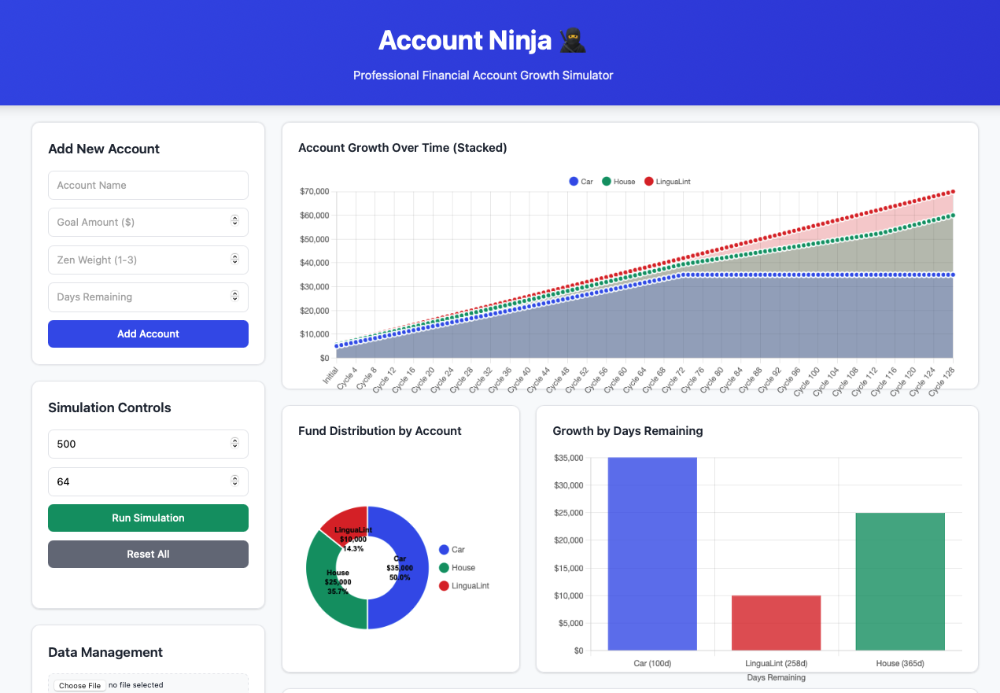
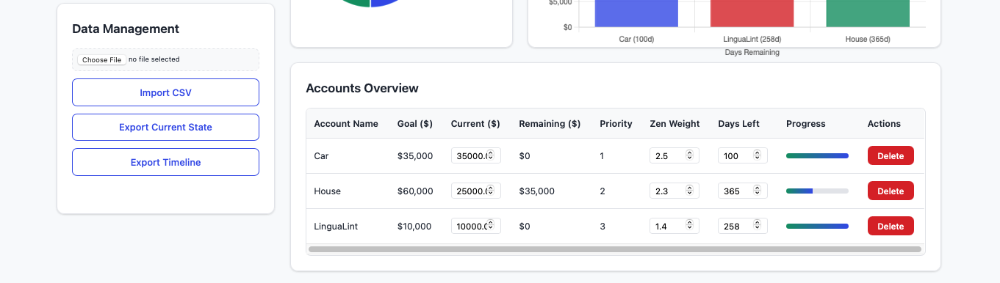
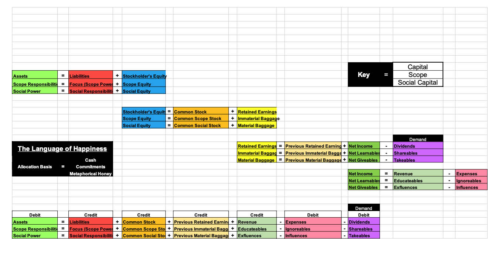

# Account Ninja 🥷

**Amateur Financial Account Growth Simulator with Real-time Dashboard**

Account Ninja is a sophisticated client-side web application that helps you simulate and visualize financial account growth and contribution strategies. Instead of manually exporting data to external tools like Tableau, Account Ninja provides real-time, interactive charts and professional dashboard visualization directly in your browser.


*Real-time visualization dashboard with stacked area charts, distribution analysis, and account management*

## ✨ Features

### 📊 Real-time Data Visualization
- **Account Growth Over Days**: Stacked area chart showing individual account growth over actual days elapsed
- **Distribution Analysis**: Doughnut chart with direct labels showing fund allocation by account
- **Days Remaining Analysis**: Bar chart showing account growth relative to time constraints
- **Interactive Dashboard**: Professional financial dashboard interface with consistent color coding


*Comprehensive account management with drag-and-drop reordering, inline editing, and progress tracking*

### 🎯 Account Management
- Add multiple financial accounts with goals, priorities, and time constraints
- Drag-and-drop reordering to adjust account priorities
- Real-time editing of account parameters
- Progress bars showing completion status
- 3Zen weighting system for balanced allocation strategies

### 🚀 Simulation Engine
- Multi-cycle distribution simulation with intelligent fund allocation
- Configurable cycle duration (days per cycle) for flexible time modeling
- Algorithm based on priority, zen weight, and time remaining
- Real-time visualization updates during simulation with days elapsed tracking
- Export simulation timelines for external analysis

### 💾 Data Management
- Import/export account data via CSV
- Local storage persistence
- Timeline simulation export
- Current state snapshots

## 🛠 Technology Stack

- **Frontend**: Pure HTML5, CSS3, JavaScript (ES6+)
- **Visualization**: Chart.js for interactive charts with custom label rendering
- **Storage**: Browser localStorage
- **Architecture**: Client-side only (no backend required)

## 🚀 Getting Started

1. **Clone or download** this repository
2. **Open `index.html`** in any modern web browser
3. **Start adding accounts** using the control panel
4. **Run simulations** and watch the real-time visualizations update

No installation, build process, or server setup required!

## 📈 How It Works

### Account Parameters
- **Goal Amount**: Target amount for the account
- **Current Amount**: Present balance (editable)
- **Priority**: Order-based priority (1 = highest priority)
- **3Zen Weight**: Allocation multiplier (1.0-3.0) - A qualitative measure where you ask yourself: "Does this account allocation make sense, cents, and scents?" (logical sense, financial sense, intuitive feel)
- **Days Remaining**: Time constraint for reaching the goal

### Allocation Algorithm
The simulation uses a sophisticated weighted allocation algorithm:
```
Calculated Weight = (3Zen Weight × (1 / Days Remaining)) / Priority
```

Funds are distributed proportionally based on calculated weights, ensuring accounts with higher priority, more 3zen weight, and less time remaining get prioritized appropriately.

## 📊 Dashboard Components

### Control Panel
- Account creation and management
- Simulation parameters
- Data import/export controls

### Visualization Panel
- **Account Growth Over Days Elapsed**: Stacked area chart showing individual account progression over actual time
- **Fund Distribution**: Doughnut chart with direct labels showing allocation percentages
- **Days Remaining Chart**: Bar chart visualizing urgency-based allocation

### Accounts Table
- Comprehensive account overview with progress bars
- Inline editing capabilities for all parameters
- Drag-and-drop reordering for priority management

## 💡 Example Use Case: Capital Framework


*Example implementation showing Social Capital, Scope Capital, and Material Capital allocation strategy*

Account Ninja is particularly effective for implementing structured capital allocation frameworks, allowing you to:
- Balance different types of capital investments
- Visualize allocation strategies over time
- Adjust priorities based on changing circumstances
- Track progress toward multiple financial goals simultaneously

## 📄 License

This project is licensed under the **GNU General Public License v3.0 (GPLv3)**.

### What this means:
- ✅ **Free to use** for any purpose
- ✅ **Free to modify** and customize
- ✅ **Free to distribute** copies
- ✅ **Free to distribute** your modifications
- ⚠️ **Must include** license and copyright notices
- ⚠️ **Must provide** source code when distributing
- ⚠️ **Must use** same license for derivative works

See the [LICENSE](LICENSE) file for the complete license text.

## 👨‍💻 Author & Contact

**Jefferson Richards**  
📧 Email: [Jefferson@richards.plus](mailto:Jefferson@richards.plus)

## 🤝 Contributing

Contributions are welcome! Since this project is licensed under GPLv3:

1. Fork the repository
2. Create your feature branch
3. Make your changes
4. Ensure your code includes proper license headers
5. Submit a pull request

All contributions will be licensed under the same GPLv3 license.

## 🔧 Development

### File Structure
```
account.ninja/
├── index.html          # Main application HTML
├── style.css           # Professional dashboard styling
├── script.js           # Core application logic and visualization
├── LICENSE             # GPLv3 license text
├── README.md           # This file
└── docs/               # Documentation images
    ├── interactive-dashboard.png    # Full dashboard screenshot
    ├── data-management.png         # Account management interface
    └── CapitalScopeSocial.png      # Capital framework example
```

### Key Classes and Functions
- `AccountNinja`: Main application class with consistent color management
- Chart management with Chart.js integration and custom label rendering
- Drag-and-drop functionality for account reordering
- CSV import/export with robust parsing
- Local storage persistence with simulation history

## 🎨 Design Philosophy

Account Ninja follows modern financial dashboard design principles:
- **Clean, professional interface** suitable for financial planning
- **Real-time feedback** with consistent color coding across all charts
- **Responsive design** that works on desktop and mobile
- **Accessibility-focused** with proper contrast and navigation
- **Performance-optimized** for smooth interactions and animations

## 🔮 Future Enhancements

Potential areas for community contribution:
- Additional chart types and visualizations
- Advanced allocation strategies and algorithms
- Goal tracking and milestone notifications
- Multi-currency support with exchange rate integration
- Advanced export formats (PDF reports, Excel workbooks)
- Integration with financial APIs and data sources
- Mobile app version with offline capabilities

---

**Account Ninja** - Transform your financial planning with professional visualization tools, all running locally in your browser. No servers, no subscriptions, just powerful financial simulation at your fingertips.